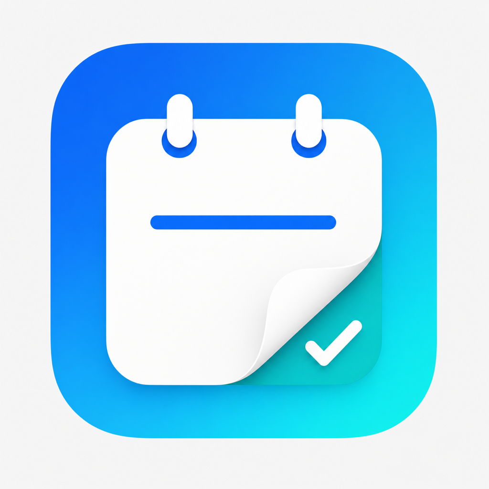

# Actlogicom, LLC

Practical solutions for operations, logistics, and technology.

## About

Actlogicom, LLC is a diversified company focused on business operations,
logistics, and technology — helping individuals and organizations run more
efficiently.

Our name reflects the areas that shaped our foundation: activities, logistics,
and commerce. We apply that experience to streamline workflows, manage
operations, and build products and services that improve how organizations
function day to day.

Our technology portfolio includes **Agenote**, a privacy-first productivity
application for iPhone, iPad, and Mac.

## Agenote

Agenote is a daily agenda app for iPhone, iPad, and Mac that brings your
Calendar, Reminders, and notes together in one place — and connects that
agenda directly to your Obsidian vault, a Markdown folder, or Apple Notes.
There is no backend server: your data stays on your devices and syncs only
through services you already control, like iCloud or Obsidian's own sync.

### Features

- Daily agenda combining Calendar events and Reminders in one view
- Two-way connection to an Obsidian vault or a Markdown folder
- Quick capture for ideas, events, and reminders, with voice dictation
- Weekly view and a Home Screen widget for at-a-glance planning
- Optional daily routine checklist
- Light and dark themes, including several accent-color options
- No accounts, no ads, no data collection

### Platforms

Agenote is a universal app for **iPhone**, **iPad**, and **Mac**.

## Support

- [Privacy Policy](https://www.actlogicom.com/privacy-policy.html)
- [Terms of Service](https://www.actlogicom.com/terms-of-service.html)
- Contact: [contact@actlogicom.com](mailto:contact@actlogicom.com)

---

© 2026 Actlogicom, LLC
